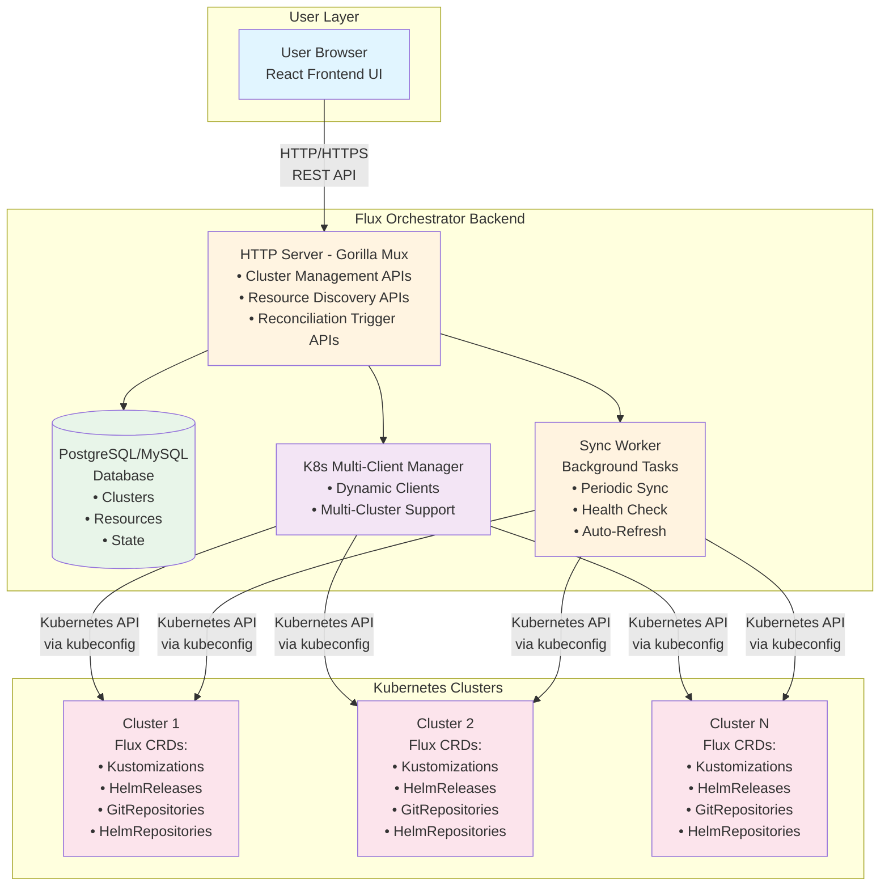

# Architecture
{: .no_toc }

System architecture and design overview.
{: .fs-6 .fw-300 }

## Table of contents
{: .no_toc .text-delta }

1. TOC
{:toc}

---

# Architecture Overview Overview

## System Architecture



## Component Details

### Frontend (React/TypeScript)

**Purpose**: Provides a web-based user interface for managing Flux across multiple clusters

**Key Features**:
- Dashboard with resource overview
- Cluster management (add, view, delete)
- Resource listing and filtering
- Real-time status updates
- Reconciliation triggers
- ArgoCD-inspired design

**Technology Stack**:
- React 18 with TypeScript
- React Router for navigation
- Axios for API calls
- Vite for build tooling

### Backend (Go)

**Purpose**: API server that orchestrates multi-cluster Flux management

**Key Components**:

1. **HTTP Server**
   - RESTful API endpoints
   - CORS middleware for frontend access
   - JSON request/response handling

2. **Database Layer**
   - PostgreSQL connection management
   - Schema initialization
   - CRUD operations for clusters and resources

3. **Kubernetes Client Manager**
   - Dynamic client creation per cluster
   - Kubeconfig parsing and validation
   - CRD discovery and querying
   - Reconciliation triggering via annotations

4. **Background Sync Worker**
   - Periodic resource synchronization (every 5 minutes)
   - Health check for all clusters
   - Automatic resource state updates

**Technology Stack**:
- Go 1.21+
- Gorilla Mux for routing
- kubernetes/client-go for K8s API
- lib/pq for PostgreSQL

### Database (PostgreSQL)

**Purpose**: Persistent storage for cluster configurations and resource state

**Schema**:

**clusters table**:
- id (PK): Unique cluster identifier (UUID)
- name: Cluster display name
- description: Optional description
- kubeconfig: Encrypted kubeconfig content
- status: Health status (healthy/unhealthy/unknown)
- created_at, updated_at: Timestamps

**flux_resources table**:
- id (PK): Unique resource identifier
- cluster_id (FK): Reference to clusters
- kind: Resource type (Kustomization, HelmRelease, etc.)
- name, namespace: Resource identifiers
- status: Resource status (Ready/NotReady/Unknown)
- message: Status message
- last_reconcile: Last reconciliation timestamp
- metadata: JSON blob with full resource data
- created_at, updated_at: Timestamps

**Indexes**:
- cluster_id for fast cluster lookups
- kind for filtering by resource type
- status for status-based queries

## Data Flow

### 1. Cluster Registration

```
User -> Frontend -> POST /api/v1/clusters
                 -> Backend validates kubeconfig
                 -> Backend creates K8s client
                 -> Backend checks cluster health
                 -> Backend saves to database
                 -> Response with cluster details
```

### 2. Resource Discovery

```
User -> Frontend -> POST /api/v1/clusters/{id}/sync
                 -> Backend queries K8s API for Flux CRDs
                 -> Backend parses resource status
                 -> Backend saves/updates in database
                 -> Response with sync result
```

### 3. Resource Reconciliation

```
User -> Frontend -> POST /api/v1/resources/reconcile
                 -> Backend adds reconcile annotation
                 -> Backend updates resource in cluster
                 -> Flux controller detects annotation
                 -> Flux reconciles the resource
```

### 4. Background Sync

```
Timer (5 min) -> Sync Worker queries active clusters
              -> For each cluster:
                 - Check health
                 - Get all Flux resources
                 - Update database
              -> Repeat
```

## Deployment Architecture

### Development

```
┌────────────┐     ┌────────────┐     ┌────────────┐
│  Frontend  │────▶│  Backend   │────▶│ PostgreSQL │
│  (npm dev) │     │ (go run)   │     │  (Docker)  │
│  :3000     │     │  :8080     │     │  :5432     │
└────────────┘     └────────────┘     └────────────┘
```

### Production (Kubernetes)

```
                 ┌─────────────────────────────┐
                 │    Central K8s Cluster      │
                 │                             │
                 │  ┌───────────────────────┐ │
                 │  │  flux-orchestrator    │ │
    Internet     │  │  Deployment           │ │
        │        │  │                       │ │
        │        │  │  - Backend + Frontend │ │
        ▼        │  │  - Service (LB)       │ │
   ┌─────────┐  │  └───────────┬───────────┘ │
   │LoadBal. │─┼──────────────▶│              │
   └─────────┘  │               │              │
                │               ▼              │
                │  ┌───────────────────────┐  │
                │  │  PostgreSQL           │  │
                │  │  StatefulSet          │  │
                │  └───────────────────────┘  │
                │                             │
                └─────────────────────────────┘
                          │
                          │ via kubeconfigs
                          │
         ┌────────────────┼────────────────┐
         │                │                │
         ▼                ▼                ▼
    ┌─────────┐      ┌─────────┐    ┌─────────┐
    │Cluster 1│      │Cluster 2│    │Cluster N│
    └─────────┘      └─────────┘    └─────────┘
```

## Security Considerations

1. **Kubeconfig Storage**: Store securely in database, consider encryption at rest
2. **RBAC**: Use ServiceAccount with minimal required permissions
3. **Network**: Use TLS for all connections
4. **Authentication**: Add authentication layer for production use
5. **Authorization**: Implement role-based access control

## Scalability

- **Horizontal Scaling**: Multiple backend instances can share database
- **Database**: PostgreSQL can handle hundreds of clusters/thousands of resources
- **Background Worker**: Configurable sync interval based on cluster count
- **Caching**: Future enhancement to cache resource states

## Extension Points

1. **Custom CRDs**: Add support for additional Flux or custom CRDs
2. **Notifications**: Integrate with notification systems
3. **Metrics**: Export Prometheus metrics
4. **Events**: Store and display Kubernetes events
5. **RBAC UI**: Add user management and permissions
